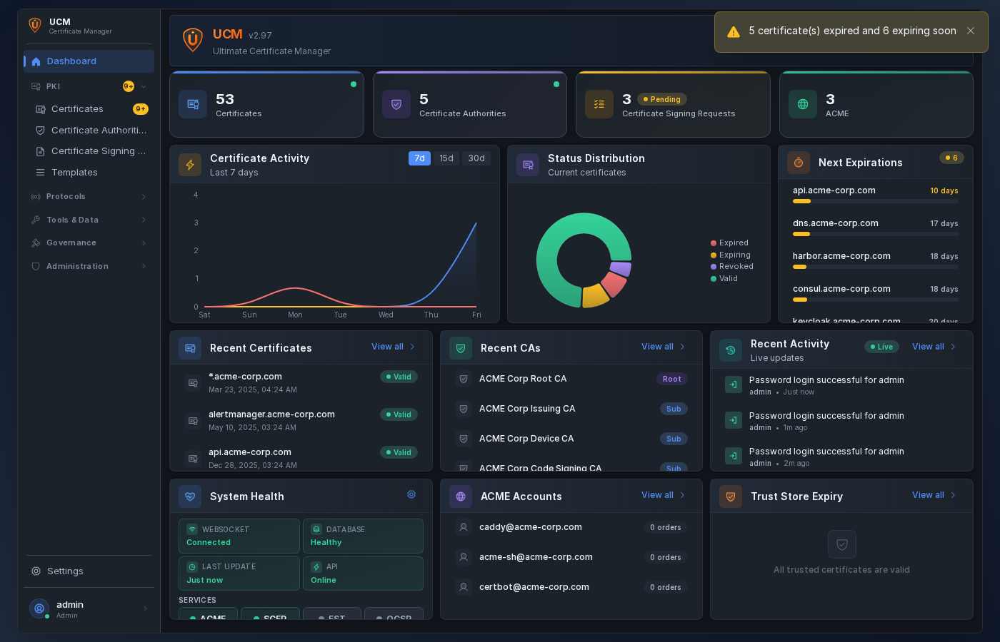

# Ultimate Certificate Manager


**Ultimate Certificate Manager (UCM)** is a web-based Certificate Authority management platform with PKI protocol support (ACME, SCEP, EST, OCSP, CRL/CDP), Microsoft ADCS integration, multi-factor authentication, and certificate lifecycle management.

> 🚀 **UCM is a young and actively developed project.** Feedback, bug reports, and feature requests are very welcome! Feel free to [open an issue](https://github.com/NeySlim/ultimate-ca-manager/issues) — every report helps make UCM better.



---

## Features

### PKI Core
- **CA Management** -- Root and intermediate CAs, hierarchy view, import/export
- **Certificate Lifecycle** -- Issue, sign, revoke, renew, export (PEM, DER, PKCS#12), bulk operations
- **CSR Management** -- Create, import, sign Certificate Signing Requests
- **Certificate Templates** -- Predefined profiles for server, client, code signing, email
- **Certificate Discovery** -- Network scanning, scan profiles, scheduled scans, certificate import
- **Trust Store** -- Manage trusted root CA certificates with expiry alerts
- **Chain Repair** -- AKI/SKI-based chain validation with automatic repair scheduler

### Protocols
- **ACME** -- RFC 8555, auto-enrollment, auto-renewal, DNS-01/HTTP-01 challenges, wildcard support
- **SCEP** -- RFC 8894 device auto-enrollment with approval workflows
- **EST** -- RFC 7030 Enrollment over Secure Transport
- **OCSP** -- RFC 6960 real-time certificate status
- **CRL/CDP** -- Certificate Revocation List distribution with Delta CRL support (RFC 5280 §5.2.4)
- **AIA CA Issuers** -- Authority Information Access CA certificate download (RFC 5280 §4.2.2.1)

### Integrations
- **Microsoft ADCS** -- Certificate signing via AD CS, template discovery, EOBO (Enroll On Behalf Of)
- **HSM** -- SoftHSM included, PKCS#11, Azure Key Vault, Google Cloud KMS
- **DNS Providers** -- Cloudflare, Route53, Azure DNS and more for ACME DNS-01 challenges
- **Webhooks** -- Event-driven notifications for certificate lifecycle events (15+ event types)

### Security & Access
- **Authentication** -- Password, WebAuthn/FIDO2, TOTP 2FA, mTLS, API keys
- **SSO** -- LDAP, OAuth2 (Azure/Google/GitHub), SAML single sign-on with role mapping
- **RBAC** -- 4 built-in roles (Admin, Operator, Auditor, Viewer) plus custom roles with granular permissions
- **Policies & Approvals** -- Certificate issuance policies with approval workflows
- **Audit Logs** -- Action logging with integrity verification and remote syslog forwarding

### Operations & Monitoring
- **Dashboard** -- Customizable drag-and-drop widgets, real-time stats, certificate trends
- **Reports** -- Scheduled PDF reports, executive summaries, custom templates
- **Certificate Toolbox** -- SSL checker, CSR/cert decoder, key matcher, format converter
- **Email Notifications** -- SMTP, customizable HTML/text templates, certificate expiry alerts
- **Backup & Restore** -- Manual and scheduled backups with retention policies
- **Software Updates** -- In-app update checker with one-click install
- **Global Search** -- Cross-resource search and command palette (Ctrl+K)

### Platform
- **6 Themes** -- 3 color schemes (Gray, Purple Night, Orange Sunset) × Light/Dark
- **i18n** -- 9 languages (EN, FR, DE, ES, IT, PT, UK, ZH, JA)
- **Responsive UI** -- React 18 + Radix UI, mobile-friendly
- **Real-time** -- WebSocket live updates
- **Multi-platform** -- Docker, Debian/Ubuntu (.deb), RHEL/Rocky/Fedora (.rpm)

---

## Quick Start

### Docker

```bash
docker run -d --restart=unless-stopped \
  --name ucm \
  -p 8443:8443 \
  -p 8080:8080 \
  -v ucm-data:/opt/ucm/data \
  neyslim/ultimate-ca-manager:latest
```

Also available from GitHub Container Registry: `ghcr.io/neyslim/ultimate-ca-manager`

### Debian/Ubuntu

Download the `.deb` package from the [latest release](https://github.com/NeySlim/ultimate-ca-manager/releases/latest):

```bash
sudo dpkg -i ucm_<version>_all.deb
sudo systemctl enable --now ucm
```

### RHEL/Rocky/Fedora

Download the `.rpm` package from the [latest release](https://github.com/NeySlim/ultimate-ca-manager/releases/latest):

```bash
sudo dnf install ./ucm-VERSION-1.noarch.rpm
sudo systemctl enable --now ucm
```

**Access:** `https://localhost:8443` or `https://your-server-fqdn:8443`
**Default credentials:** `admin` / `changeme123` — you will be prompted to change on first login.

See [Installation Guide](docs/installation/README.md) for all methods including Docker Compose and source install.

---

## Documentation

| Resource | Link |
|----------|------|
| Wiki (full docs) | [github.com/NeySlim/ultimate-ca-manager/wiki](https://github.com/NeySlim/ultimate-ca-manager/wiki) |
| Installation | [docs/installation/](docs/installation/README.md) |
| User Guide | [docs/USER_GUIDE.md](docs/USER_GUIDE.md) |
| Admin Guide | [docs/ADMIN_GUIDE.md](docs/ADMIN_GUIDE.md) |
| API Reference | [docs/API_REFERENCE.md](docs/API_REFERENCE.md) |
| OpenAPI Spec | [docs/openapi.yaml](docs/openapi.yaml) |
| Security | [docs/SECURITY.md](docs/SECURITY.md) |
| Upgrade Guide | [UPGRADE.md](UPGRADE.md) |
| Changelog | [CHANGELOG.md](CHANGELOG.md) |

---

## Technology Stack

| Component | Technology |
|-----------|------------|
| Frontend | React 18, Vite, Radix UI, Recharts |
| Backend | Python 3.11+, Flask, SQLAlchemy |
| Database | SQLite (PostgreSQL supported) |
| Server | Gunicorn + gevent WebSocket |
| Crypto | pyOpenSSL, cryptography |
| Auth | Session cookies, WebAuthn/FIDO2, TOTP, mTLS |

---

## File Locations

| Item | Path |
|------|------|
| Application | `/opt/ucm/` |
| Data & DB | `/opt/ucm/data/` |
| Config (DEB/RPM) | `/etc/ucm/ucm.env` |
| Logs (DEB/RPM) | `/var/log/ucm/` |
| Service | `systemctl status ucm` |

Docker: data at `/opt/ucm/data/` (mount as volume), config via environment variables, logs to stdout.

---

## Roadmap

- [ ] **Code Signing** — Issue and manage code signing certificates (Authenticode, JAR, macOS)
- [ ] **High Availability / Clustering** — Active-passive or active-active HA deployment
- [ ] **Kubernetes / Helm** — Helm chart and cert-manager integration
- [ ] **Post-Quantum Cryptography** — ML-DSA, ML-KEM, SLH-DSA key types (NIST FIPS 203/204/205)
- [ ] **SSH Certificates** — Issue and manage SSH host and user certificates
- [ ] **CMP Protocol (RFC 4210)** — Certificate Management Protocol support
- [ ] **Key Archival & Recovery** — Secure key escrow with recovery workflows
- [x] **Certificate Transparency (RFC 6962)** — CT log submission, SCT parsing, auto-submit on issuance *(v2.109)*
- [x] **OCSP Delegated Responder (RFC 5019)** — Per-CA delegated responder assignment with EKU validation *(v2.109)*
- [x] **Certificate Practice Statement (CPS)** — Per-CA CPS URI and Policy OID in CertificatePolicies extension *(v2.109)*
- [x] **Multiple CDP/OCSP/AIA URLs** — Multiple distribution points and access descriptions per CA *(v2.109)*
- [x] **RFC 3161 Timestamp Authority (TSA)** — Time stamping server with configurable policy, hash algorithms, and accuracy *(v2.109)*
- [x] **Security Audit** — CRITICAL/HIGH/MEDIUM vulnerability fixes, CSP headers, rate limiting, account lockout *(v2.109)*
- [x] **In-App Help Translations** — 208 help files across 8 languages for all 26 sections *(v2.109)*
- [x] **ACME Auto-Supersede** — Automatically revoke old certificates on ACME renewal *(v2.110)*
- [x] **Universal Format Detection** — DER/PEM detection by content across all file uploads *(v2.110)*
- [x] **PKCS7/PKCS12 Decode** — Certificate decoder supports P7B bundles and PKCS12 files *(v2.111)*
- [x] **Delta CRL** — Incremental CRL updates for large deployments *(v2.75)*

## Contributing

1. Fork the repository
2. Create feature branch (`git checkout -b feature/my-feature`)
3. Commit and push
4. Open Pull Request

---

## License

BSD 3-Clause License with Commons Clause -- see [LICENSE](LICENSE).

---

## Support

- [GitHub Issues](https://github.com/NeySlim/ultimate-ca-manager/issues)
- [GitHub Wiki](https://github.com/NeySlim/ultimate-ca-manager/wiki)

